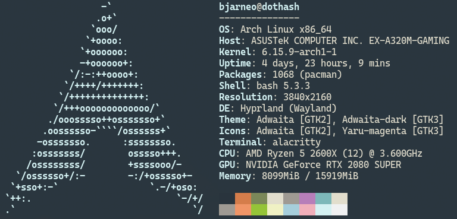

# Omarchy Serenity Theme

This is the Serenity theme for [Omarchy.org](https://omarchy.org), providing a visually appealing configuration set for your Linux desktop environment.

> A quiet mind, a steady hand,
> Across the code, a peaceful land.
> No raging seas, no fiery gleam,
> Just the calm flow of a gentle stream.

<p align="center">
  
</p>

<p align="center">
  
</p>

## Installation

To install this theme, simply use the `omarchy-theme-install` command:

```bash
omarchy-theme-install https://github.com/bjarneo/omarchy-serenity-theme
```

## X.com
[iamdothash](https://x.com/iamdothash)
